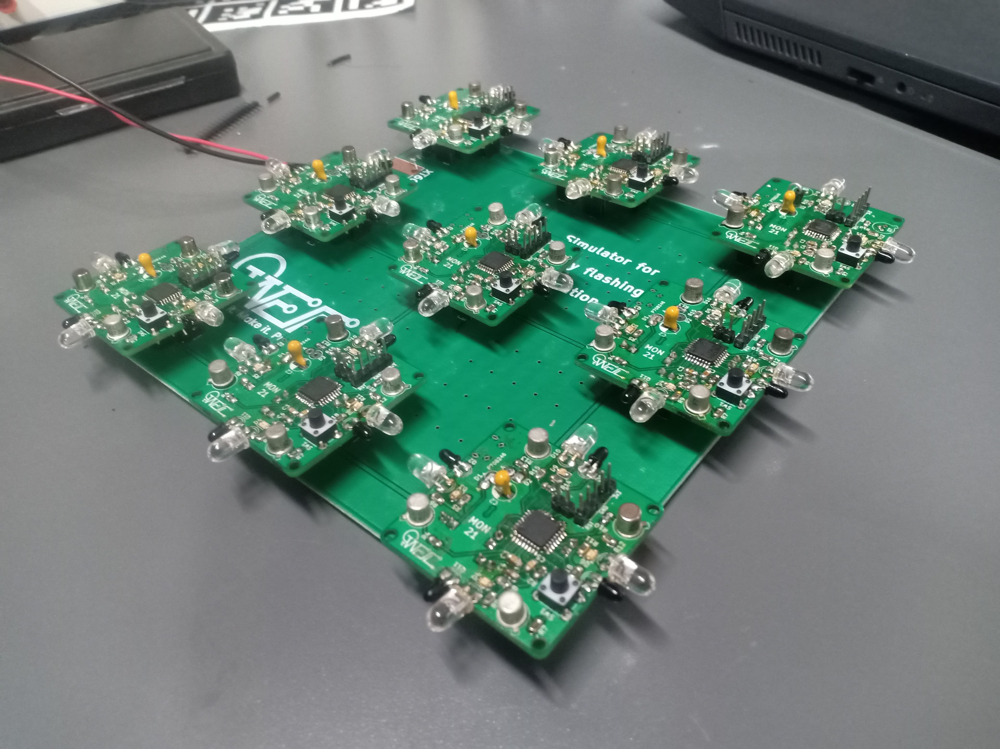

## 🔥 Project Overview – *Synchronization for Firefly Simulator*  
### 🧠 Team Number: MON-21

👥 **Team Members:**  
- Mohammad Sami  
- Shivam Panwar  
- Gogineni Venkat Sumanth  
- Juluva Yashwanth  
- Lokesh  

---

### 📌 Problem Statement & Solution

Synchronization is a fundamental phenomenon in complex systems 🌐. To study it in real-time with flexibility, we need a programmable system with tunable parameters.

🧾 **Limitations of Old Designs:**  
The classical 1993 electronic fireflies lacked programmability and flexibility.  

⚙️ **Modern Solution:**  
Thanks to advancements in microcontrollers, we now have digital control and customizable experimentation possibilities.

---

### 🔧 Prototyping Journey

**🧩 Initial Prototype:**  
We designed a basic STM32 board with just the microcontroller to gain hands-on experience with PCB design using **STM32G030K8T6**.

**🔁 Second Iteration:**  
Integrated IR LEDs, photodiodes, and supporting components onto the board. Fabricated 2-3 units to test functionality, sync accuracy & design refinements.

**✅ Final Prototype:**  
After validation, we manufactured **9 boards (3×3 matrix)** for full-scale synchronization testing.

💻 Throughout, software development and debugging ran parallel to hardware iterations for smooth integration.

🧑‍🏫 The **STM32G030X** was suggested by our professor due to its suitability.  
🔦 The IR LED & photodiode combo was chosen for ambient light resistance and reliability in synchronization.

---

### ⚙️ Component Choices

- **🔲 STM32G030K8T6**  
  → Chosen from STM32G030 series (as fixed by prof) due to sufficient specs, easy soldering & availability.

- **🔦 IR LED & Phototransistor Pair**  
  → *SFH 4550 & SFH 309 FA*  
  → IR avoids visible light interference. The photodiode has peak sensitivity near **850nm** (matching our IR LED) and a narrow FOV for accurate detection.

- **🧰 Other Components**  
  → Transistors, LDO, micro USB connectors – sourced from WEL stock.

---

### 🚀 Running the Application

1. **🎯 Microcontroller:**  
   - STM32G030K8T6 or STM32G030K6T6  

2. **🛠 IDE:**  
   - STM32CubeIDE  

3. **📥 Compilation & Upload Steps:**  
   - Install **STM32CubeIDE**  
   - Download the `final.ioc` file from the **STM32G030K8T6** folder inside `src`  
   - Load `.ioc` file in your IDE  
   - Save the file to auto-generate code  
   - Replace the generated `main.c` with the `main.c` from the same folder  
   - Build the project 🏗️  
   - Flash the code using **StLink V2** (or equivalent)  
   - 🎉 Synchronization begins once phototransistors start detecting LED flashes!

---

Final Product

